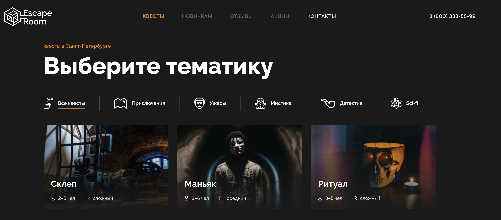
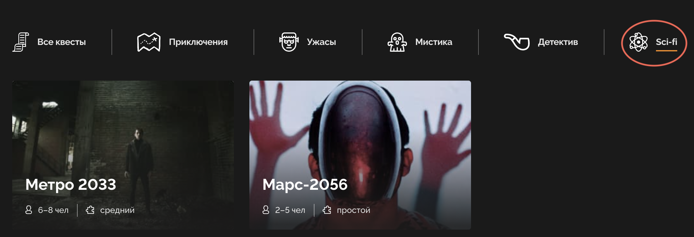
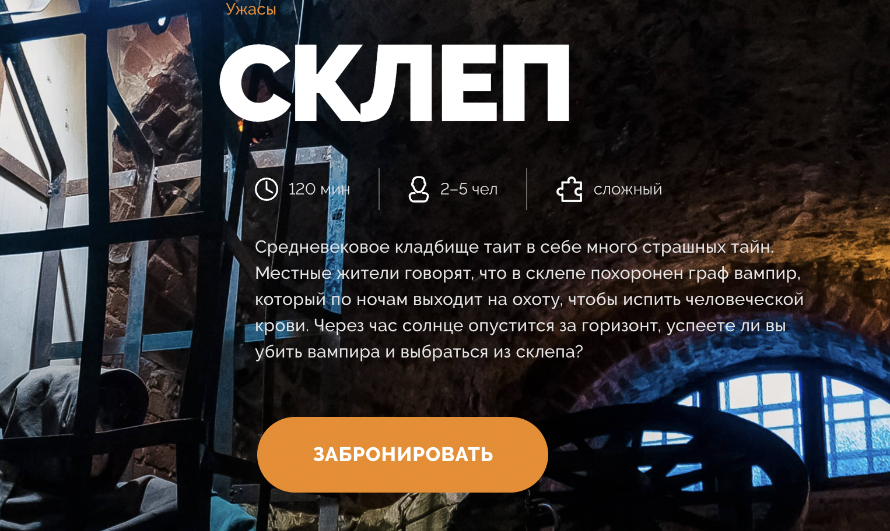
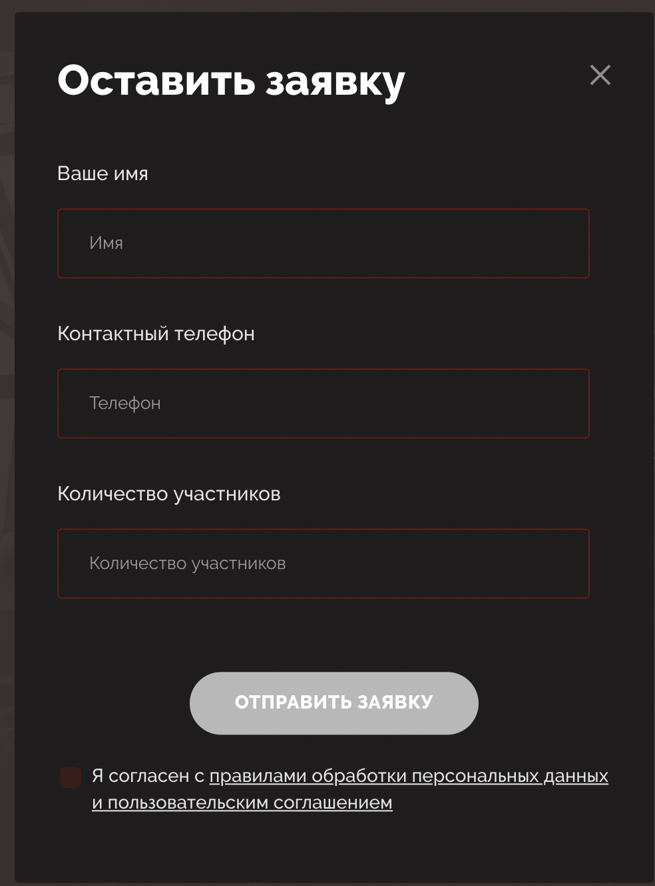
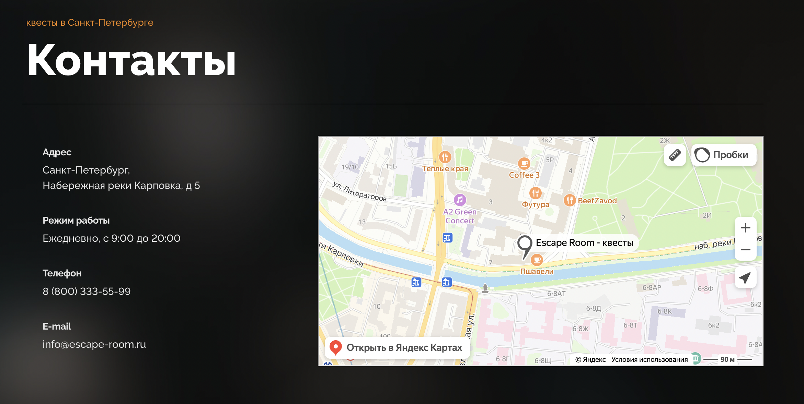

### Escape room



Escape room - is a simple site to select entertainment quest in Saint Petersburg.



You can choose the type of quest you are interested in. There is a bar above the list of quests.



Also, you can get detailed information about every quest in the list by clicking a preview image. There is description of quest plot, play time, amount of people and level. By clicking a big orange button you can book it.



A pretty familiar simple form to give your contacts for booking. All fields are required.



And there is a contacts page with an interactive map.

## Stack:
- React,
- Redux,
- Typescript,
- Styled-components,
- React Dom Router.

Time spent: ~25 hours.

## Demo (without server):

[Go to Escape room >>](https://escape-room-lisabazdyreva.vercel.app/)
Please, run a server locally.

## How to run locally:

- Clone repository:
```bash
git clone git@github.com:lisabazdyreva/escape-room.git
```

- Install dependencies:
```bash
npm install
```

- Run app:
```bash
npm run start
```
